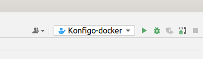
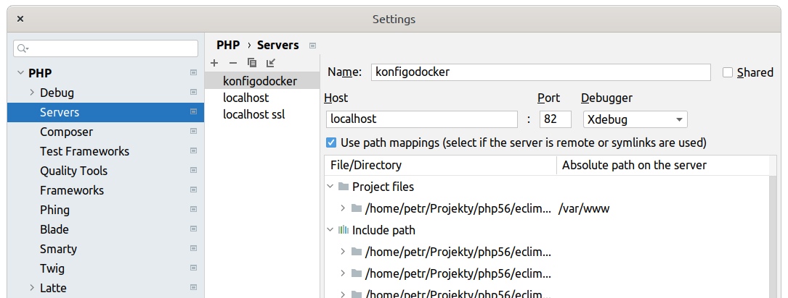

# Nette test elastic search

backend swsystems 

## Ostra verze
- webserver
    - http://localhost:82
    - branch: master
    - apache2 s mod_rewrite, prip. nginx s zohlednenim veci v .htaccess
    - php8.0
        - mysql
        - mysqli
        - pdo_mysql
        - mailparse
        - mbstring
        - xdebug
- databaze:
    - server: docker.for.mac.localhost:3307
    - databaze:
        - test


## Instalace vyvojoveho prostredi

### Stazeni databazi
Vsechny databaze predpokladame, ze bezi na localhostu, stahnout a importnout vyse uvedene databaze.

### Stazeni z repozitare
```sh
git clone https://gitlab.ssemi.cz/root/nette-elastic.git
```


### Inicializace projektu
#### Konfigurace
Mistni nastaveni projektu
```sh
cp ./app/config/config.local.neon.template ./app/config/config.local.neon
```

- **cookiePath**: !!! Dulezite !!! - v pripade, ze projekt bezi v podadresari, je nutne nastavit cookiePath na prislusnou hodnotu odpovidajici url,
  jinak nebude spravne fungovat session a session cookie se muze dostat do konfliktu s jinymi projekty.
  Pri single site na dedikovanem portu dockeru vsak postaci mit hodnotu "/"
- **database**: Pripojeni k databazi bezici na hostu je mozne pres **127.0.0.1** v pripade sdilene site (host network). Pri specificky mapovanych portech a oddelene siti je vsak do hostname treba dat **host.docker.internal**
  Zaroven na db serveru je treba otevrit sitovou komunikaci

Konfigurace debug hostu - do tohoto souboru pridat svoji IP, aby se zobrazovala Tracy,
pripadne vynutit debug rezim podle potreby
```sh
cp ./app/config/debug.conf.php.template ./app/config/debug.conf.php
```

#### Nastaveni opravneni na adresarich (pravo zapisu pro webserver, nebo pro vsechny)
```sh
chmod -R 0777 ./log
chmod -R 0777 ./data
```

### Nastaveni dockeru

#### Zkopirovat vzor do aktualniho yml
```sh
cp docker-compose.yml.template docker-compose.yml
```
Dev prostredi pro docker je nastavene defaultne na host port 82 (kvuli zabraneni konfliktu s lokalnim apache)
Localhost sit se sdili s hostem, takze aplikace v kontejneru se muze primo pripojit na databazi bezici na hostu.
Pripadne jine nastaveni site v docker-compose.yml, mapovani souboru/adresaru do kontejneru tamtez.


#### Build image
```sh
docker-compose build
```
Toto by melo stahnout a nastavit vse potrebne

#### Sestaveni a spusteni kontejneru
```sh
docker-compose up
```
V tuto chvili by mel byt docker projekt ready na http://localhost:82


### Pridat docker konfiguraci do phpstorm
Je mozne pridat si docker konfiguraci (me to beha i bez toho) pro snadnejsi ovladani kontejneru
- Run>Edit configurations
    - Pridat novou, typ **Docker compose**
    - do compose files nalistovat docker-compose.yml




### Xdebug 3.1.1
V PHPStormu nastavit v File>Settings>PHP>Debug
- debug port: 9003
- vypnout "Force break at first line when a script is outside of project" aby to neodchytavalo adminery a podobne veci kolem

Kdyz se pouziva host network, potom v tuto chvili uz je to funkcni.

#### Nastaveni PHPstorm pro remote ports
- v ./docker/php.ini zapnout **xdebug.discover_client_host**
- File>Settings>PHP>Servers
    - pridat remote server
        - host: localhost, port: 82
        - zapnout path mappings
        - koren projektu namapovat na server dir /var/www
          
      


